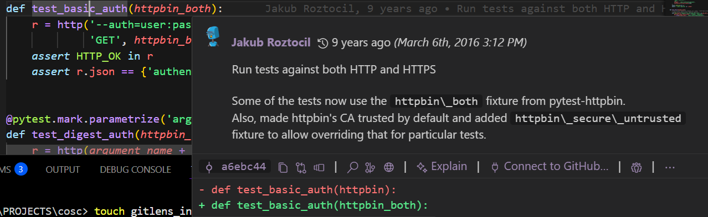
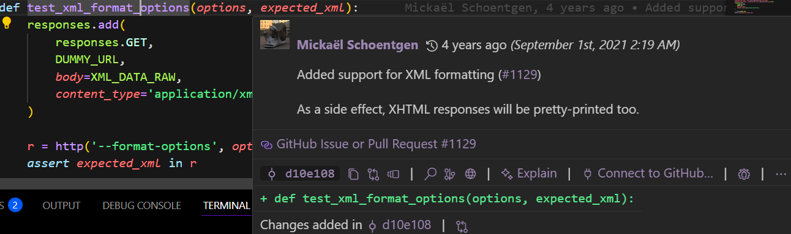

## Repository 
 https://github.com/httpie/cli

## File 1
- **File Name**: test_auth.py
- **Function name**: test_basic_auth(httpbin_both)
- **Author**:  Jakub Roztocil 
- **Last Updated**: 9 years ago (March 6th, 2016 3:12 PM)   
- **Commit**: `a6ebc44a488ed8f25ba4056c974d2060e16e6953` 

## File 2
- **File Name**: test_xml.py
- **Function name**: test_xml_format_options
- **Author**:   Mickaël Schoentgen 
- **Last Updated**:  4 years ago (September 1st, 2021 2:19 AM) 
- **Commit**: `d10e108b5f8fbcb96c1fce43057f37ababe9efde` 

## Screenshot

